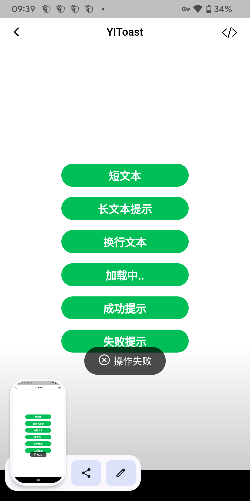

# CHANGELOG

## 1.2.7
1. `YlFloatingBottom` 优化阴影效果，使只有组件顶部显示阴影。

## 1.2.6
1. `YlButton` 中，设定icon的默认样式，颜色跟随文字颜色，大小固定为24

## v1.2.5
1. `YlTextFormField` 增加 `countTrim` 属性，用于计数时，是否去除前后空白符，默认为 `false`
2. 修复 `YlTextFormField` 多行文本时，计数字符会与输入文字重叠的问题

## v1.2.4
1. 新增 Selector Form 组件

1. YlToast 迭代

旧 | 新 
-- | --
 | 
 |  
 | 